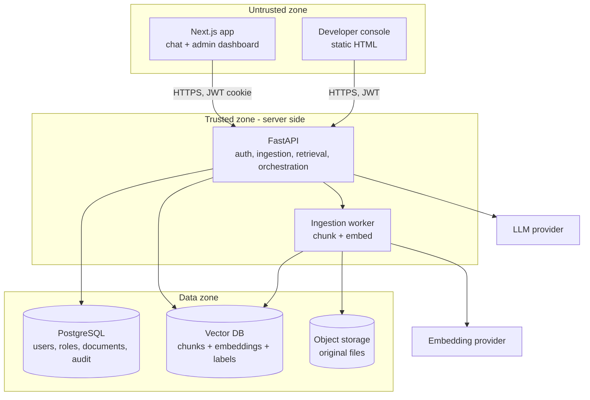
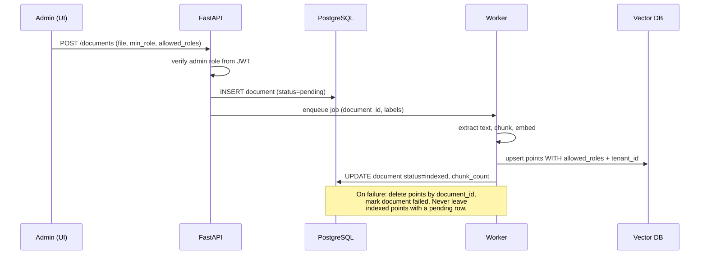
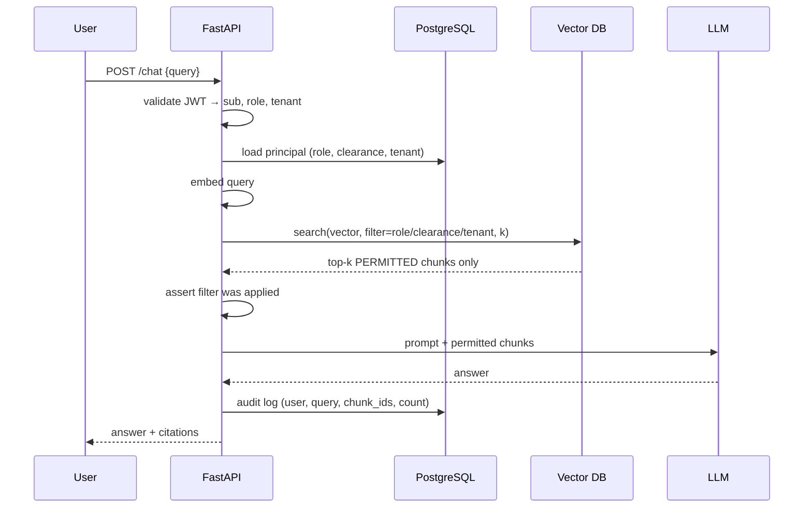
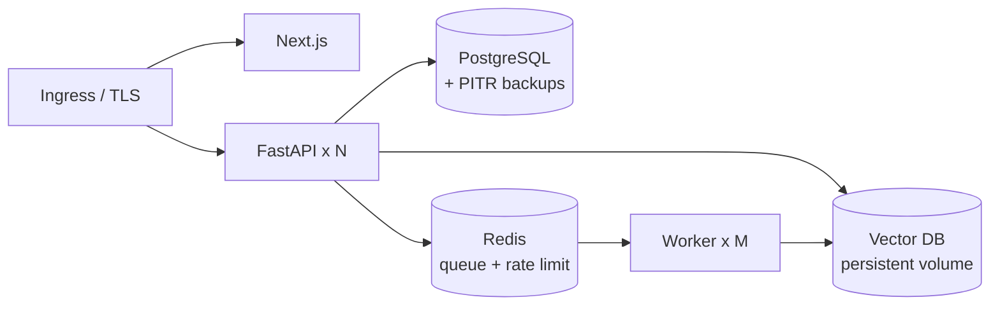

# Architecture

Contents:
1. Component map
2. Trust boundaries
3. Data flow — ingestion
4. Data flow — query
5. Threat model
6. Deployment topology
7. Scaling and operational notes
8. Decisions to record

---

## 1. Component map

The client never talks to PostgreSQL, the vector DB, or the LLM. There is one
ingress: FastAPI. This is not architectural taste — it is what makes the
authorization filter unbypassable. Any component that can reach the vector DB
directly is a component that can skip the filter.

## 2. Trust boundaries

| Boundary | Crossing | What must be verified |
|---|---|---|
| Browser → API | HTTPS + JWT cookie | Signature, expiry, issuer, audience. Role is read from claims, never from the body. |
| API → Vector DB | Internal network | Filter is present and non-empty. Assert it before the call. |
| API → LLM | Egress to third party | Only permitted chunks in the prompt. Log the chunk ids sent, never the text. |
| Worker → Vector DB | Internal network | Every upserted point carries `allowed_roles` and `tenant_id`. Reject unlabeled points. |
| Admin → API | Same as browser | Admin role checked server-side per endpoint, not by hiding UI. |

The vector DB and PostgreSQL sit on a private network with no public ingress.
In Docker Compose that means no published ports for `postgres` and `qdrant` in
the production profile — dev profile can publish them, and that difference
should be an explicit profile, not a comment someone forgets to act on.

## 3. Data flow — ingestion

Labels are decided before embedding and travel with the chunk. There is no
window in which a chunk is searchable without a label — if the upsert carries no
`allowed_roles`, the worker rejects the batch rather than defaulting to public.
Defaulting to public is how this system fails.

Chunking guidance: 400–800 tokens with 10–15% overlap for prose; respect
document structure (don't split a table row across chunks). Store
`document_id`, `chunk_index`, and `source_page` in the payload — the chat UI
needs them for citations, and the audit log needs them to answer "what exactly
did this user see."

## 4. Data flow — query

Note what is absent: there is no step where the API receives chunks and decides
which to keep. If that step exists in your code, you built the post-filtering
version.

The audit log entry records chunk ids, not chunk text. You want to be able to
reconstruct what a user was shown without creating a second copy of the
classified corpus in your logging system.

## 5. Threat model

| Threat | Vector | Mitigation |
|---|---|---|
| Role escalation via request | Client sends `role=Admin` in body | Role read only from validated JWT; body fields ignored and rejected |
| Stale privilege | User demoted, old token still valid | Short token TTL (15 min) + refresh; check `role_version` or re-read role from PG per request for high-sensitivity deployments |
| Direct vector DB access | Leaked credentials, exposed port | Private network, no published port, per-service credentials, rotate |
| Prompt injection in a document | Malicious doc instructs model to reveal other context | Filter is upstream of the model — the model only ever holds permitted chunks. Also strip instruction-like content at ingest and never let the model call retrieval with a caller-supplied filter |
| Inference from citations | Blocked doc titles leak via UI | Return citations only for chunks the user retrieved; never list "N results hidden" to non-admins |
| Debug endpoint leak | Trace endpoint returns excluded text | Endpoint returns counts + filter expression only; admin-gated; disabled unless `DEBUG_TRACE=true`; refuses to start when `ENV=production` |
| Embedding inversion | Attacker with vector read access reconstructs text | Treat embeddings as sensitive as source text; same network and credential controls |
| Tenant bleed | Multi-tenant filter forgotten on one path | `tenant_id` added inside `retrieve()`, not by callers; single retrieval function |
| Deletion that isn't | PG row deleted, points remain | Vector delete first, verify by count, then PG delete |

The two mitigations that carry the most weight: **one retrieval function** and
**role from token only**. Most real leaks in systems like this are not clever
attacks — they are a second code path added six months later that forgot.

## 6. Deployment topology

Compose is fine for development and small internal deployments. When you move
to Kubernetes, the properties to preserve are: no public route to the data
tier, per-service credentials, and workers that can't serve HTTP.

Secrets: never bake into images. Environment injection for development, a
secrets manager for anything real. The embedding and LLM API keys live only in
API and worker.

## 7. Scaling and operational notes

- **Filter selectivity matters.** A highly selective filter (one rare role) plus
  an HNSW index can degrade recall, because the graph traversal walks through
  many non-matching points. Qdrant handles this with payload indexes and an
  automatic fallback to exact search on small filtered sets — create the payload
  index on `allowed_roles` or the filter is a linear scan.
- **Cardinality of roles.** Keep role count in the tens, not thousands. If you
  need per-user ACLs, model it as a group id array on the point, and keep the
  user's group list small. Thousands of ids in an array will hurt.
- **Cache with the principal in the key.** Any retrieval cache keyed only on the
  query string is a cross-role leak. Key on `(tenant, role, query_hash)` — or
  don't cache retrieval at all.
- **Re-index cost.** Changing a role's meaning means updating every affected
  point's payload. Payload updates are cheap in Qdrant (no re-embedding) —
  design for it rather than fearing it.
- **Observability.** Emit: filter expression, candidate count, returned count,
  latency, and whether a fail-closed path fired. Alert on a returned count of
  zero spiking, which usually means a filter bug rather than a corpus gap.

## 8. Decisions to record

Write these down in an ADR alongside the code — the reviewer's first questions:

1. Role list, clearance level, or both? Why?
2. Which vector DB, and what happens to the filter semantics if you switch?
3. Token TTL, and whether role is re-read from PostgreSQL per request.
4. Chunk size and overlap, and how citations map back to source pages.
5. What the system does when retrieval returns zero permitted chunks — the
   answer should be an honest "no accessible documents cover this", never a
   fallback to unfiltered search or to the model's own knowledge presented as
   if it came from company documents.
